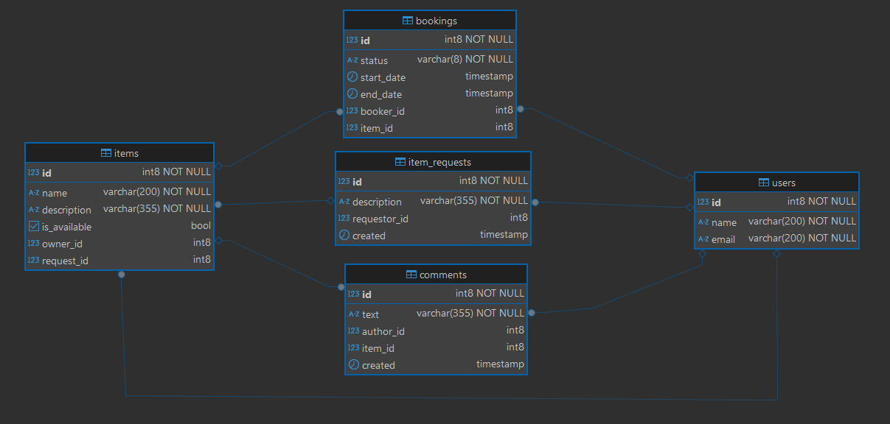

# ShareIt - сервис аренды вещей

## Описание проекта
ShareIt - это многомодульное Spring Boot-приложение, позволяющее пользователям брать в аренду различные предметы 
(инструменты, технику, спортивный инвентарь) у других пользователей.

**Основные возможности:**
- Удобная система бронирования с проверкой доступности вещи на запрашиваемые даты
- Возможность создания запросов на предметы, если они недоступны
- Система уведомлений о новых запросах и откликах
- Возможность оставлять отзывы об арендованных вещах

## Архитектура
Проект состоит из двух модулей:
1. **shareit-gateway** - API Gateway для фильтрации и маршрутизации запросов
    - Отсеивает невалидные запросы, снижая нагрузку на основной сервис
    - Передает корректные запросы в основной сервис
    - Порт: 8080

2. **shareit-server** - основной сервис с бизнес-логикой
    - Обрабатывает все запросы, связанные с пользователями, предметами, бронированиями и комментариями
    - Порт: 9090

## Технологический стек
- **Язык**: Java 21
- **Фреймворки**: Spring Boot, Spring Data JPA, Hibernate
- **Базы данных**: PostgreSQL (основная), H2 (для тестов)
- **Библиотеки**: Lombok, SLF4J
- **Тестирование**: JUnit, Mockito, Spring Boot Test
- **Инструменты**: Docker, Maven, Postman, DBeaver, IntelliJ IDEA

## База данных
Приложение использует реляционную базу данных PostgreSQL со следующей схемой:


Основные таблицы:
- `users` - информация о пользователях
- `items` - предметы для аренды
- `bookings` - информация о бронированиях
- `item_requests` - запросы на предметы
- `comments` - отзывы о предметах

SQL для создания таблиц доступен в файле `schema.sql`.

## Функциональность
### USER
**Поддерживаемые API-запросы:**
* Создание нового пользователя\
`POST /users`
* Обновление данных пользователя (частичное)\
`PATCH /users/{userId}`
* Получение информации о пользователе\
`GET /users/{userId}`
* Удаление пользователя\
`DELETE /users/{userId}`

**Пример запроса:**\
`POST /users`\
request body
```json
{
    "name": "Veronica Parisian",
    "email": "Mckenna_Ward@yahoo.com"
}
```
response (200 code)
```json
{
    "id": 1,
    "name": "Veronica Parisian",
    "email": "Mckenna_Ward@yahoo.com"
}
```

**Технические особенности:**
* Слоистая архитектура (Controller → Service → Repository)
* Маппинг DTO ↔ Entity через UserMapper
* Оптимизированный поиск по email (case-insensitive через LOWER(u.email))
* Spring Data JPA для работы с БД

**Валидация:**
* Email должен быть уникальным и корректным (проверка через UserValidator)
* Пользователь должен существовать при обновлении/удалении (иначе NotFoundException)
* Обязательные поля: name, email (не null)

### ITEM
**Поддерживаемые API-запросы(`@RequestHeader("X-Sharer-User-Id")`):**
* Добавление новой вещи \
  `POST /items`
* Обновление данных вещи \
  `PATCH /items/{itemId}`
* Получение информации о вещи (с комментариями и бронированиями)\
  `GET /items/{itemId}`
* Получение всех вещей владельца\
  `GET /items`
* Поиск вещей по названию/описанию\
  `GET /items/search?text={query}`
* Удаление вещи\
  `DELETE /items/{itemId}`
* Добавление комментария к вещи\
  `POST /items/{itemId}/comment`

**Пример запроса:**\
`POST /items`\
request body
```json
{
    "name": "name",
    "description": "description",
    "available": false
}
```
response (200 code)
```json
{
    "id": 1,
    "name": "name",
    "description": "description",
    "available": false,
    "request": null
}
```

**Особенности:**
* Привязка вещи к владельцу (`owner_id`)
* Возможность указания запроса (`request_id`), если вещь добавлена в ответ на запрос
* Поиск вещей с учетом доступности (`is_available = true`)
* Получение информации о вещи включает:
   * Последнее бронирование
   * Следующее бронирование
   * Комментарии

**Технические особенности:**
* Нативные SQL-запросы для сложных выборок (поиск по тексту, бронирования)
* Кастомные мапперы (`ItemMapper`) для преобразования DTO ↔ Entity
* Ленивая загрузка связанных сущностей (`FetchType.EAGER` для `owner` и `request`)
* Оптимизированный поиск:
   * Case-insensitive через `ILIKE`
   * Фильтрация по доступности (`is_available`)

**Валидация:**
* Пользователь должен существовать при создании/обновлении вещи
* Вещь должна существовать при обновлении/удалении (иначе NotFoundException)
* Обязательные поля: name, description, isAvailable (не null)
* Поиск по тексту: игнорируется, если запрос пустой

### COMMENT
**Поддерживаемые API-запросы(`@RequestHeader("X-Sharer-User-Id")`):**
* Добавление комментария к вещи\
  `POST /items/{itemId}/comment`

**Пример запроса**\
`POST /items/{itemId}/comment`\
request body
```json
{
    "text": "text"
}
```
response (200 code)
```json
{
    "id": 1,
    "text": "text",
    "authorName": "authorName",
    "created": "2025-07-01T22:34:57.8854698",
    "itemName": "itemName"
}
```

Особенности:
* Комментарии могут оставлять только пользователи, которые:
   * Бронировали данную вещь
   * Завершили бронирование (проверка через `BookingValidator`)
* Автоматическое связывание комментария:
   * С вещью (`item_id`)
   * С автором (`author_id`)

Технические особенности:
* Каскадная проверка зависимостей:
   * Существует ли вещь (`ItemRepository`)
   * Существует ли пользователь (`UserRepository`)
   * Было ли бронирование (`BookingRepository`)
* Валидация бронирования:
   * Проверка, что бронирование завершено (`BookingValidator.checkBooking()`)
* Маппинг DTO ↔ Entity через `CommentMapper`

### BOOKING
**Поддерживаемые API-запросы(`@RequestHeader("X-Sharer-User-Id")`):**
* Создание нового бронирования\
`POST /bookings`		
* Подтверждение/отклонение бронирования\
`PATCH /bookings/{bookingId}`
* Получение информации о бронировании\
`GET /bookings/{bookingId}`
* Получение бронирований текущего пользователя\
`GET /bookings`
* Получение бронирований вещей владельца\
`GET /bookings/owner`
* Удаление бронирования\
`DELETE /bookings/{bookingId}`

**Пример запроса**\
`POST /bookings`\
request body
```json
{
    "itemId": 3,
    "start": "2025-07-02T22:31:37",
    "end": "2025-07-03T22:31:37"
}
```
response (200 code)
```json
{
    "id": 1,
    "start": "2025-07-02T22:31:37",
    "end": "2025-07-03T22:31:37",
    "item": {
        "id": 3,
        "name": "name",
        "description": "description",
        "isAvailable": false,
        "owner": {
            "id": 5,
            "name": "Ruby Homenick",
            "email": "Estell_Halvorson@yahoo.com"
        },
        "request": null
    },
    "booker": {
        "id": 6,
        "name": "Martha Olson",
        "email": "Angelina35@yahoo.com"
    },
    "status": "WAITING"
}
```

**Особенности:**
* Поддержка различных статусов бронирования: `WAITING`, `APPROVED`, `REJECTED`, `CURRENT`, `PAST`, `FUTURE`
* Пагинация для списков бронирований (`from`, `size`)
* Автоматическая проверка доступности вещи при создании бронирования
* Валидация дат бронирования (начало должно быть раньше конца)
* Разделение прав доступа:
   * Только владелец вещи может подтверждать/отклонять бронирование
   * Пользователь может просматривать только свои бронирования

**Технические особенности:**
* Нативные SQL-запросы для сложных выборок:
   * Текущие бронирования (`start_date < NOW() AND end_date > NOW()`)
   * Прошедшие бронирования (`end_date < NOW()`)
   * Будущие бронирования (`start_date > NOW()`)
* Кастомные мапперы (`BookingMapper`) для преобразования DTO ↔ Entity
* Логирование всех операций через `@Slf4j`
* Поддержка сортировки по дате начала бронирования

**Валидация:**
* Проверка существования:
   * Пользователя
   * Вещи
   * Бронирования
* Проверка доступности вещи (`isAvailable`)
* Проверка корректности дат (начало < конец)
* Проверка прав доступа:
   * Только владелец может подтверждать бронирование
   * Пользователь может просматривать только свои бронирования

### REQUEST
**Поддерживаемые API-запросы(`@RequestHeader("X-Sharer-User-Id")`):**
* Создание нового запроса вещи\
`POST /requests`
* Получение всех запросов текущего пользователя\
`GET /requests`
* Получение информации о конкретном запросе\
`GET /requests/{requestId}`
* Получение всех запросов других пользователей (пагинация поддерживается)\
`GET /requests/all`

**Пример запроса**\
`POST /requests`\
request body
```json
{    
    "description": "description"
}
```
response (200 code)
```json
{
    "id": 1,
    "requestor": {
        "id": 9,
        "name": "Jackie Bruen",
        "email": "Arlene76@hotmail.com"
    },
    "description": "description",
    "created": "2025-07-01T22:38:44.1795731"
}
```

**Особенности:**
* Автоматическое проставление даты создания запроса (`LocalDateTime.now()`)
* Сортировка запросов по дате создания (от новых к старым)
* Возвращение полной информации о запросе, включая список вещей, созданных в ответ на него
* Разделение прав доступа:
   * Пользователь может просматривать только свои запросы через `GET /requests`
   * Все пользователи могут просматривать запросы других через `GET /requests/all`

**Технические особенности:**
* Нативные SQL-запросы для выборок
* Кастомные мапперы (`ItemRequestMapper`) для преобразования:
   * `ItemRequest` ↔ `ItemRequestDto`
   * `ItemRequest` ↔ `ItemRequestWithItemsDto`
* Логирование операций через `@Slf4j`
* Оптимизация запросов:
   * Отдельные запросы для получения запросов и связанных вещей (`ItemRepository.findByRequestId`)

**Валидация:**
* Проверка существования пользователя при создании запроса
* Проверка наличия запроса при получении по ID (`NotFoundException`)
* Проверка обязательных полей:
   * `description` не может быть пустым
* Автоматическая валидация DTO через Spring (`@RequestBody`)

## Конфигурация
Основные настройки приложения:

Gateway
```properties 
server.port=8080
shareit-server.url=http://localhost:9090
```
Сервер
```properties
server.port=9090
spring.datasource.url=jdbc:postgresql://localhost:5432/shareit
spring.datasource.username=postgres
spring.datasource.password=1234
spring.jpa.hibernate.ddl-auto=none
```

### Взаимодействие между модулями
Модули взаимодействуют через REST API с использованием RestTemplate. Основная логика взаимодействия реализована в 
классе BaseClient, который обрабатывает все типы HTTP-запросов (GET, POST, PUT, PATCH, DELETE) и добавляет необходимые 
заголовки.

Пример использования:
```java
public ResponseEntity<Object> getUser(Long userId) {
return get("/users/{userId}", userId);
}
```

## Запуск проекта с Docker Compose

Проект включает готовую конфигурацию Docker Compose для развертывания всех компонентов:

1. **shareit-gateway** - API Gateway (порт 8080)
2. **shareit-server** - основной сервис (порт 9090)
3. **postgres** - база данных PostgreSQL (порт 6541)